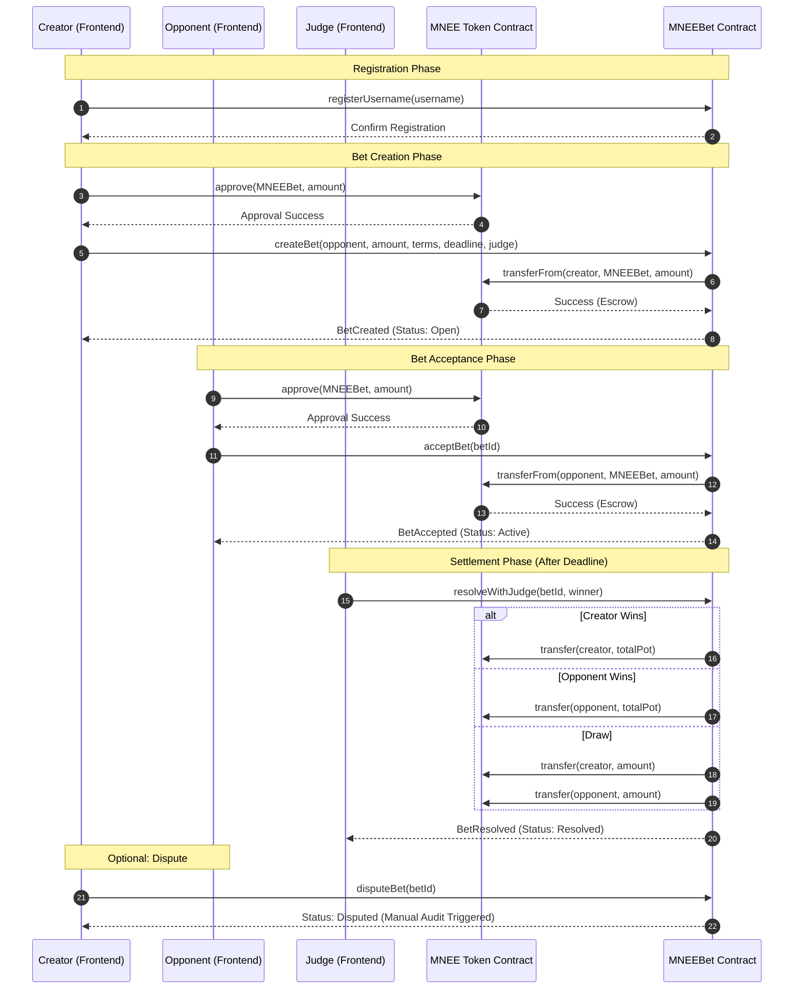

# MNEEBet Technical Architecture

This document provides a detailed breakdown of the MNEEBet protocol architecture, process flows, and smart contract design.

## 🏗️ System Overview

MNEEBet is a decentralized peer-to-peer wagering protocol built on Ethereum. It leverages the **MNEE USD stablecoin** to provide a stable, predictable unit of account for betting, eliminating the volatility risks associated with traditional crypto assets.

### Core Components

1.  **MNEEBet Smart Contract**: The central logic engine that handles escrow, bet lifecycle management, and payouts.
2.  **MNEE Token (ERC-20)**: The collateral currency (USD stablecoin).
3.  **Frontend Interface**: A Next.js 16.1.1 based dApp for interacting with the protocol.
4.  **Wallet Integration**: Utilizes RainbowKit and Wagmi for seamless wallet connectivity.

---

## 📊 Process Flow (Mermaid)

---

## 🔄 Bet Lifecycle

1.  **Open**: The bet is created by User A. Funds are in escrow.
2.  **Active**: User B accepts the bet. Both users' funds are now locked in the contract.
3.  **Resolved**: The designated Judge verifies the outcome and pays out the winner.
4.  **Disputed**: (Optional) Either party flags the bet for manual review.

---

## 🔒 Security Measures

-   **ReentrancyGuard**: All state-changing functions are protected against reentrancy attacks.
-   **Atomic Payouts**: The judge resolution and token transfer happen in a single transaction, ensuring the winner is paid immediately.
-   **Access Control**: Only the designated judge can resolve a specific bet.
-   **Emergency Pause**: The contract owner can pause the protocol in case of critical bugs.

---

## 🗺️ Roadmap

### Phase 1: MVP Launch (Current)
- [x] Core P2P betting engine implementation.
- [x] MNEE stablecoin escrow integration.
- [x] Human judge resolution system.
- [x] Decentralized username registry.
- [x] Sepolia testnet deployment for hackathon validation.

### Phase 2: Mainnet Expansion (Q2 2026)
- [ ] **Ethereum Mainnet Deployment**: Migrating core contracts to Ethereum Mainnet using the official MNEE token (`0x8ccedbAe4916b79da7F3F612EfB2EB93A2bFD6cF`).
- [ ] **Smart Contract Audit**: Comprehensive security audit by top-tier firms.
- [ ] **MNEE Ecosystem Partnership**: Deep integration with MNEE liquidity pools and yield-bearing collateral.
- [ ] **Advanced Betting Logic**: Support for multi-party bets (1vN) and tournament brackets.

### Phase 3: Intelligence & Automation (Q4 2026+)
- [ ] **AI Resolution Assistant**: Leveraging LLMs to analyze bet terms and provide evidence-based recommendations to judges.
- [ ] **Betting Oracles Integration**: Automated resolution for sports, weather, and financial markets via Chainlink or Pyth.
- [ ] **Mobile-Native Experience**: Launch of progressive web app (PWA) with push notifications for bet updates.
- [ ] **DAO Governance**: Transitioning protocol parameters (fees, judge selection) to MNEEBet token holders.

---

## 🛠️ Technical Stack

-   **Blockchain**: Ethereum (Sepolia for demo)
-   **Smart Contracts**: Solidity 0.8.20+
-   **Frontend**: Next.js 16.1.1, Tailwind CSS
-   **State Management**: Wagmi, TanStack Query
-   **UI Components**: Radix UI, Lucide Icons, Framer Motion
-   **Wallet Connectivity**: RainbowKit, Ethers v6
