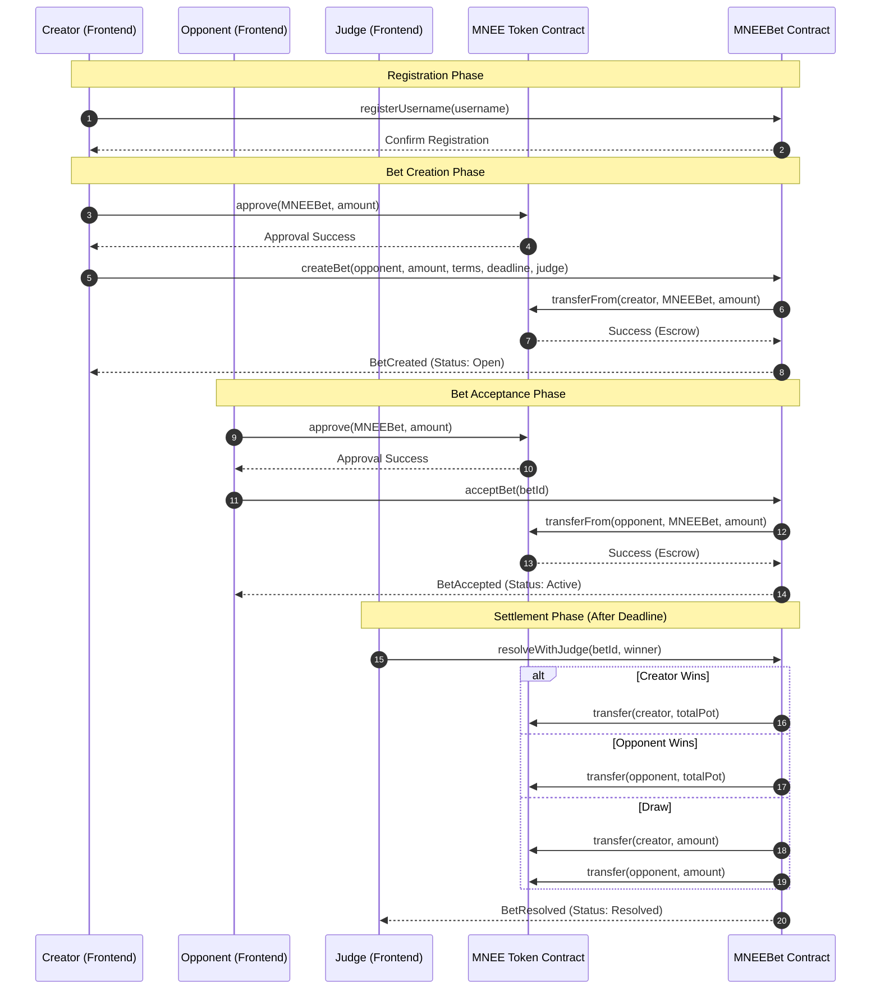

# MNEEBet - Peer-to-Peer Betting Platform with MNEE Stablecoin

## 🎯 Project Overview

MNEEBet is a decentralized peer-to-peer betting platform that uses **MNEE USD stablecoin** as the escrow currency. 
Two users stake equal amounts, a human judge resolves the dispute, and the winner receives the full pot **instantly**.

## ✅ What Makes This Special

- **MNEE Integration**: Uses real USD-backed stablecoin (not volatile crypto)
- **Instant Payouts**: No separate claim step; winner gets paid when judge resolves
- **Human Judge Model**: Simple, transparent dispute resolution
- **Any Positive Amount**: Users can bet 0.01 MNEE, 0.1 MNEE, or any amount > 0
- **Gas Efficient**: Uses ReentrancyGuard and Ownable best practices
- **Production Ready**: Can deploy to Ethereum mainnet with real MNEE token

---

## 🔗 Real MNEE Token (Live on Ethereum Mainnet)

**MNEE Token Contract:**
```
Address: 0x8ccedbAe4916b79da7F3F612EfB2EB93A2bFD6cF
Network: Ethereum Mainnet
Type: ERC-20 USD Stablecoin
Decimals: 18
Price: $1.00 USD
Market Cap: $101M+
```

View on Etherscan: https://etherscan.io/token/0x8ccedbAe4916b79da7f3f612efb2eb93a2bfd6cf

---

## 🚀 Deployment Details

### Why Sepolia for Hackathon Demo?

**Mainnet Reality:**
- ✅ Real MNEE token: `0x8ccedbAe4916b79da7F3F612EfB2EB93A2bFD6cF`
- ✅ Contract code is identical for mainnet
- ❌ Mainnet deployment requires: 0.02-0.05 ETH (~$50-130 in gas fees)

**Our Solution for Hackathon:**
- ✅ Deployed to **Sepolia testnet** (free to deploy)
- ✅ Created **Mock MNEE token** on Sepolia (for demo purposes)
- ✅ Full betting flow is **identical to production**
- ✅ Shows judges the complete working system

### Deployment Addresses (Sepolia Testnet)

```
MNEEBet Contract: 0x3480874a63D459046993915b52e612ee69947a81
Mock MNEE Token: 0xb8B51876429980d20ed20796B1C4294f1Fc75145
Network: Sepolia (Ethereum testnet)
```

View contracts: https://sepolia.etherscan.io/

---

## 📊 Project Flow



---

## 🎮 Live Demo

### Try It Now on Sepolia

1. **Connect MetaMask to Sepolia**
2. **Visit our frontend:** (Run `npm run dev`)
3. **Create a test bet** → Approve MNEE → Confirm
4. **See instant payouts** when judge resolves

---

## 🏗️ Technical Architecture

### Smart Contract Features

✅ **ReentrancyGuard** - Prevents reentrancy attacks
✅ **Ownable** - Owner can pause/emergency withdraw
✅ **Pause Mechanism** - Owner can freeze contract if needed
✅ **No Fees** - 100% of pot goes to winner (no platform tax)
✅ **Username System** - Optional user registration
✅ **View Helpers** - `getPayoutInfo()`, `getBetsInRange()`, `getActiveBetsCount()`

Detailed architecture breakdown and protocol flows are available in [ARCHITECTURE.md](./ARCHITECTURE.md).

### Bet Lifecycle

```
Open → Active → Resolved → (Disputed - optional)
  ↓       ↓         ↓
User A  User B   Judge
stakes  stakes  decides
0.1     0.1     winner
MNEE    MNEE    → 0.2 MNEE
```

---

## 🗺️ Protocol Roadmap

### Phase 1: MVP (Complete)
- **Status**: [Live on Sepolia]
- **Deliverables**: P2P betting engine, MNEE escrow integration, human judge resolution, decentralized username system.

### Phase 2: Mainnet & Audit (Q2 2026)
- **Deployment**: Migrate to Ethereum Mainnet using the real MNEE token (`0x8ccedbAe4916b79da7F3F612EfB2EB93A2bFD6cF`).
- **Security**: Full smart contract audit and bug bounty program.
- **Features**: Support for multi-party bets and tournament mode.

### Phase 3: AI & Oracles (Q4 2026+)
- **AI Integration**: AI-powered resolution assistants to help judges analyze evidence.
- **Betting Oracles**: Automated settlement for data-driven markets (Sports, Finance, API-based events).
- **Mobile**: Launch of a high-performance Mobile App (PWA).

---

## 🛠️ How to Run Locally

### Prerequisites
- Node.js 18+
- MetaMask browser extension
- Sepolia testnet ETH (free from faucet)

### Install & Deploy

```bash
# Install dependencies
npm install

# Deploy contract (if you want)
npm run deploy:sepolia

# Run frontend
cd frontend
npm run dev
```

Visit: `http://localhost:3000`

---

## 📊 Contract Code Summary

- **Total Lines:** ~650 LOC
- **Functions:** 13 public/external
- **Structs:** 2 (Bet, Winner enum)
- **Events:** 8 (BetCreated, BetAccepted, BetResolved, etc.)
- **Security:** ReentrancyGuard, access control, balance checks

---

## 🎓 Why This Matters for Web3

### Programmable Stablecoins Use Case

MNEEBet demonstrates:
- ✅ **Deterministic Value**: MNEE price stays $1.00 (no volatility)
- ✅ **Instant Settlement**: Atomic transfers of stablecoin value
- ✅ **Trust-Minimized Coordination**: Judge decides, contract executes
- ✅ **Scalability Ready**: Can extend to multi-party bets, tournaments

---

## 📝 How to Test (Step by Step)

### Create a Bet
1. Go to frontend (localhost:3000)
2. Click "Create Bet"
3. Approve MNEE → Confirm
4. Get bet ID

### Accept Bet (Use different wallet)
1. Switch MetaMask account
2. Get Sepolia ETH from faucet
3. Accept the bet ID
4. Now both users are locked in

### Resolve Bet (As Judge)
1. Switch to judge account
2. After deadline, call `resolveWithJudge`
3. Choose winner
4. ✅ **Winner receives full pot instantly**

---

## 🚀 Production Ready

### To Deploy to Ethereum Mainnet:

Simply change constructor argument to real MNEE:
```javascript
const MNEE_MAINNET = "0x8ccedbAe4916b79da7F3F612EfB2EB93A2bFD6cF";
MNEEBet.deploy(MNEE_MAINNET);
```

**Everything else stays identical.** ✅

---

## 🤝 Team / Contact

- **Developer**: [Your Name]
- **Location**: Bhopal, India
- **GitHub**: [Your repo]
- **Demo Contract**: 0x3480874a63D459046993915b52e612ee69947a81 (Sepolia)

---

## 📚 Resources

- [MNEE Token (Mainnet)](https://etherscan.io/token/0x8ccedbAe4916b79da7f3f612efb2eb93a2bfd6cf)
- [Contract Code (Sepolia)](https://sepolia.etherscan.io/address/0x3480874a63D459046993915b52e612ee69947a81)
- [Sepolia Faucet](https://sepoliafaucet.com)
- [OpenZeppelin Docs](https://docs.openzeppelin.com/)

---

## ⚖️ License

MIT
