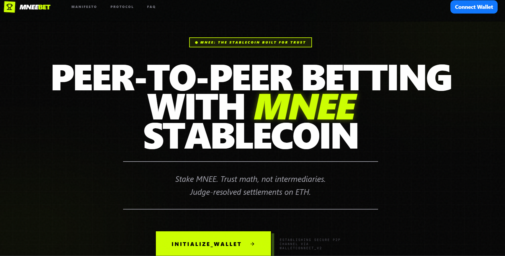
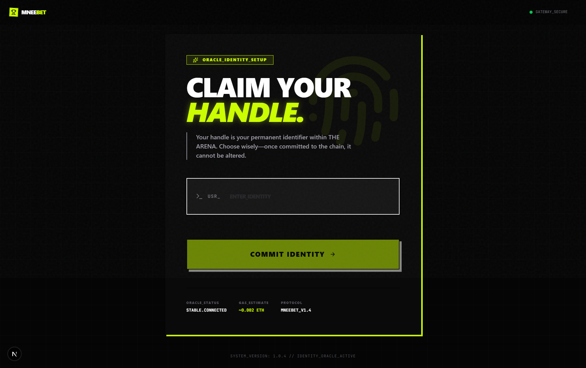
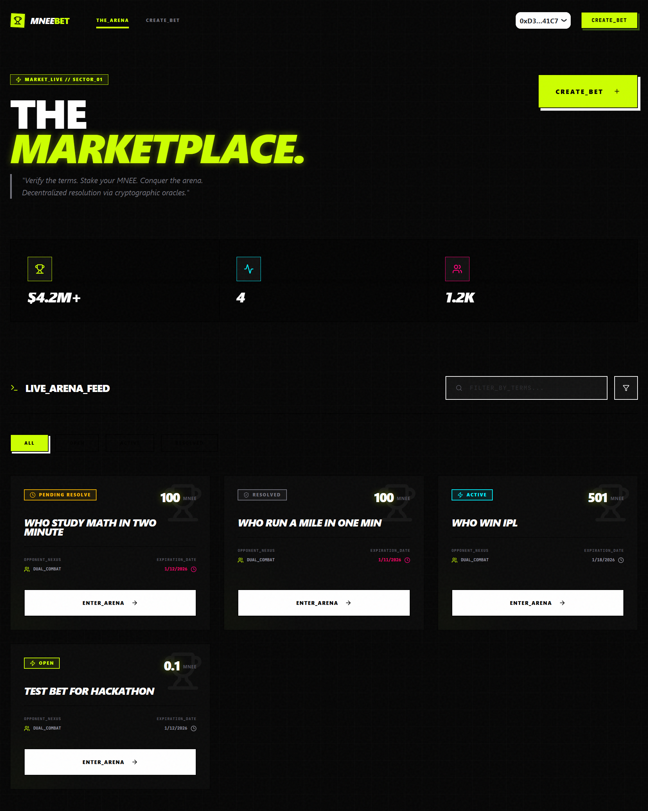
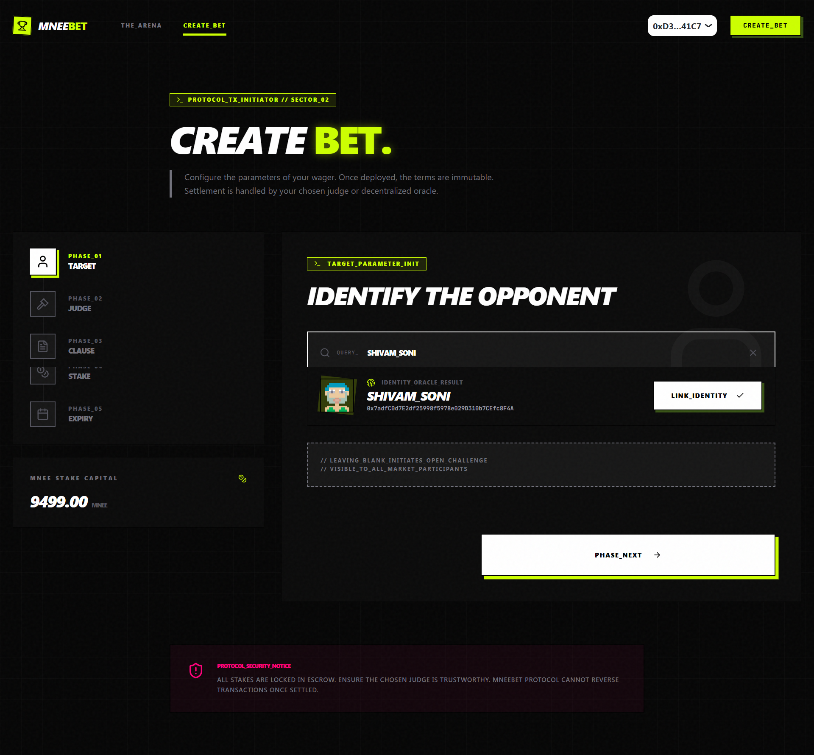
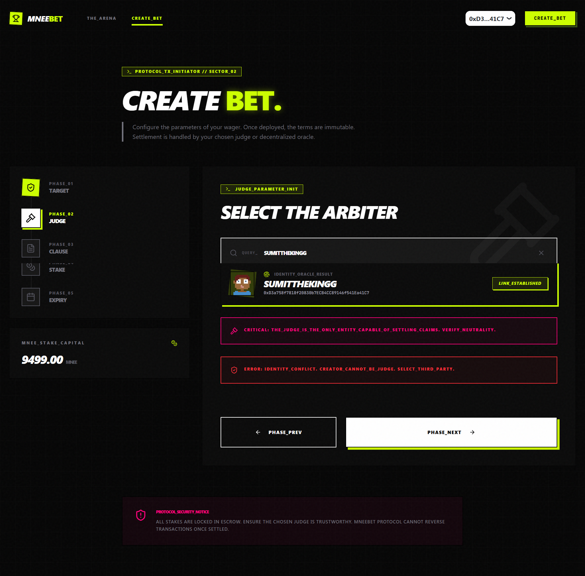
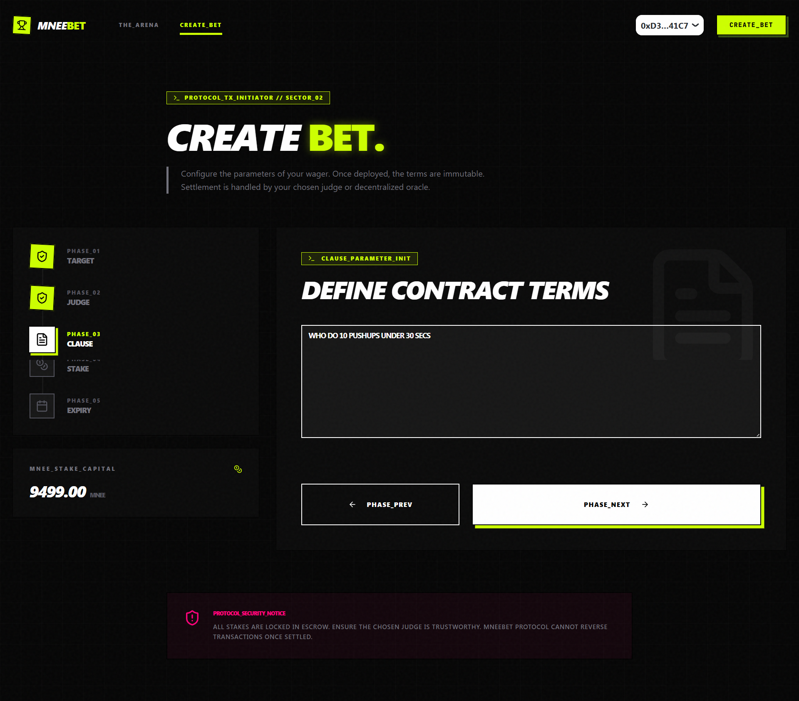
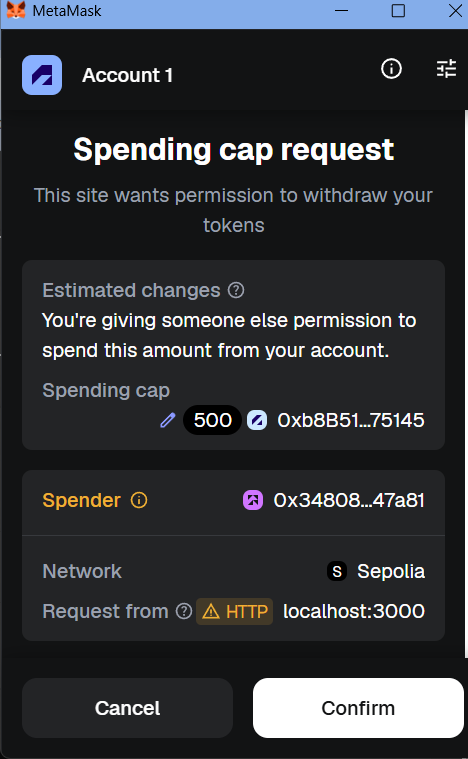
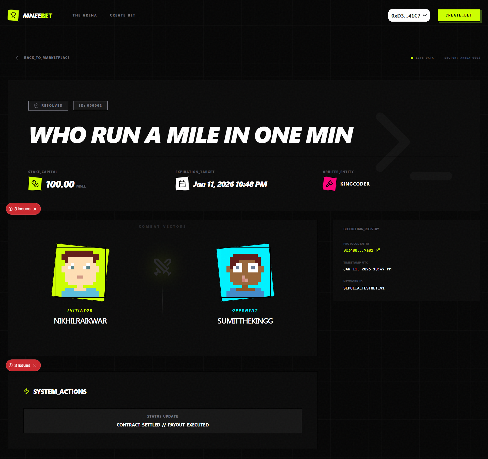
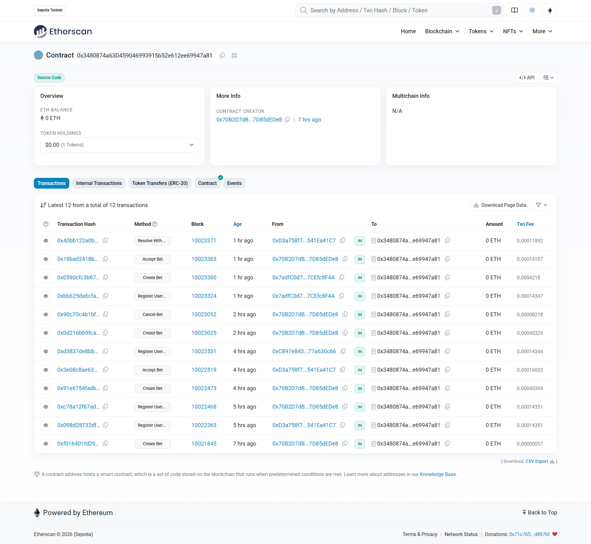
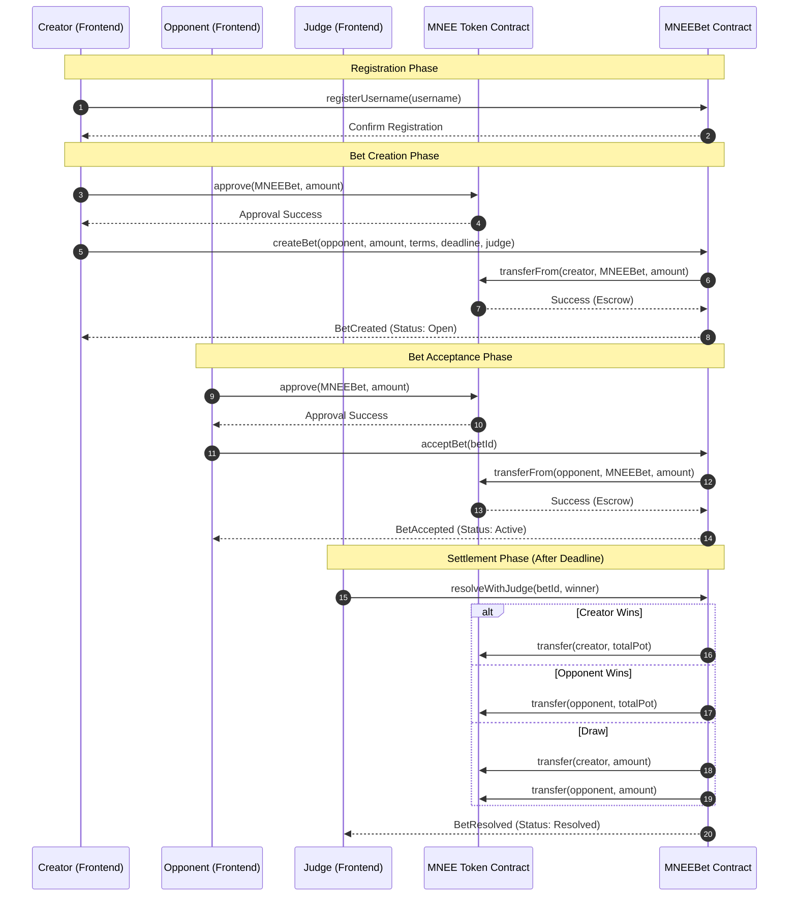

# MNEEBet - Decentralized P2P Betting Arena

<div align="center">


**🏆 Built for MNEE Hackathon: Programmable Money for Agents, Commerce, and Automated Finance**

</div>

---

## 🎯 Project Overview

MNEEBet is a **fully decentralized peer-to-peer betting platform** that leverages **MNEE USD-backed stablecoin** as the escrow currency. Two users stake equal amounts, a human judge resolves disputes, and the winner receives the full pot **instantly** through atomic smart contract execution.

### Why MNEEBet Matters

Traditional betting platforms suffer from:
- ❌ Centralized custody of funds
- ❌ Hidden fees and unfair house edges
- ❌ Delayed payouts and account freezes
- ❌ Price volatility in crypto bets
- ❌ Lack of transparency

**MNEEBet solves all of these problems:**
- ✅ **Non-custodial escrow** - funds locked in smart contract
- ✅ **Zero platform fees** - 100% of pot goes to winner
- ✅ **Instant settlement** - atomic payout on resolution
- ✅ **Stable value** - MNEE maintains $1.00 USD peg
- ✅ **Transparent & immutable** - all actions on-chain

---

## 🚨 Important Deployment Notice

### Current Status: Sepolia Testnet Deployment

**Due to insufficient ETH for mainnet deployment, this hackathon submission currently runs on Sepolia testnet.**

**What This Means:**
- ✅ **Full Protocol Implementation**: Complete smart contract with all production features
- ✅ **Identical Codebase**: Exact same contract ready for mainnet deployment
- ✅ **Mock MNEE Token**: Created on Sepolia to demonstrate real MNEE integration
- ✅ **Production Architecture**: Built for Ethereum mainnet from day one

**Mainnet Deployment Requirements:**
- Real MNEE Token: `0x8ccedbAe4916b79da7F3F612EfB2EB93A2bFD6cF` (Ethereum Mainnet)
- Estimated Gas: ~0.03-0.05 ETH (~$80-130 USD)
- **Status**: Awaiting deployment funds

**Current Deployment:**
```
Network: Sepolia Testnet
MNEEBet Contract: 0x3480874a63D459046993915b52e612ee69947a81
Mock MNEE Token: 0xb8B51876429980d20ed20796B1C4294f1Fc75145
```

**Post-Hackathon Plan:**
Once deployment funds are secured, the contract will be deployed to Ethereum mainnet with zero code changes. Simply update the MNEE token address in the constructor:

```solidity
// Current (Testnet)
MNEEBet(0xb8B51876429980d20ed20796B1C4294f1Fc75145);

// Mainnet Ready
MNEEBet(0x8ccedbAe4916b79da7F3F612EfB2EB93A2bFD6cF);
```

---

## 📸 Project Walkthrough

### 1. Landing Page - Enter the Arena

*Brutalist design with clear value proposition and immediate wallet connection*

### 2. Identity Registration - Claim Your Handle

*On-chain identity system for reputation building and user discovery*

### 3. Bet Marketplace - Browse Active Challenges

*Real-time feed of open and active bets, filterable by status and searchable by terms*

### 4. Bet Creation Wizard - Configure Your Wager

#### Step 1: Select Opponent

*Choose specific opponent or leave open for anyone to accept*

#### Step 2: Assign Judge

*Select trusted third-party arbiter for dispute resolution*

#### Step 3: Define Terms

*Write clear, specific terms that define winning conditions*

#### Step 4: Set Stake Amount

*Define the MNEE amount each party will stake*

#### Step 5: Confirm & Deploy

*Review all parameters before committing to the blockchain*

### 5. MetaMask Transaction Flow


*Seamless wallet integration with clear transaction details*

### 6. Bet Resolution - Confirmed & Settled

*Live bet showing resolved status with initiator vs opponent, judge verdict, and blockchain registry confirmation. Contract automatically settles and pays out winner.*

### 7. Smart Contract Verification

*Verified smart contract on Sepolia testnet (mainnet-ready)*

---

## 🎯 Hackathon Alignment

### Primary Track: **Programmable Finance & Automation**

MNEEBet demonstrates programmable finance through:

1. **Automated Escrow Management**
   - Funds automatically locked upon bet creation
   - Smart contract holds both parties' stakes securely
   - No manual intervention required

2. **Atomic Settlement Engine**
   - Winner receives full pot in single transaction
   - No claim step - instant payout on resolution
   - Zero slippage, zero fees

3. **Deterministic Financial Rules**
   - Immutable bet terms encoded on-chain
   - Judge-verified outcomes trigger automatic payouts
   - Draw conditions return equal stakes

4. **Stable Value Guarantee**
   - MNEE stablecoin eliminates price volatility
   - $1.00 USD peg maintained throughout bet lifecycle
   - No risk of pot value fluctuation during disputes

### Secondary Alignment: **Commerce & Creator Tools**

- **Creator Monetization**: Content creators can monetize predictions/outcomes
- **Community Engagement**: Build engaged communities around shared interests
- **Transparent Revenue**: 100% of pot to winner (no platform cut)

---

## 🏗️ Technical Architecture

### Protocol Flow



### Smart Contract Design

**Core Features:**
- ✅ ReentrancyGuard - Prevents reentrancy attacks
- ✅ Ownable - Emergency controls for critical situations
- ✅ Pausable - Circuit breaker for security incidents
- ✅ Username Registry - On-chain identity system
- ✅ Judge-Based Resolution - Human oracle for dispute settlement

**Bet Lifecycle:**

```
┌──────────┐
│   OPEN   │  Creator stakes MNEE → Contract holds funds
└─────┬────┘
      │
      ▼
┌──────────┐
│  ACTIVE  │  Opponent stakes → Both parties locked in
└─────┬────┘
      │
      ▼
┌──────────┐
│ RESOLVED │  Judge decides → Winner paid instantly
└──────────┘
```

**Security Measures:**
- Non-custodial: No platform holds user funds
- Time-locked: Judges can only resolve after deadline
- Access control: Only assigned judge can resolve
- Emergency withdraw: Owner can refund disputed bets after 30 days
- Reentrancy protection: All external calls use nonReentrant modifier

### Technology Stack

| Layer | Technology |
|-------|-----------|
| **Blockchain** | Ethereum (Mainnet-ready, Sepolia-deployed) |
| **Stablecoin** | MNEE ERC-20 (USD-backed) |
| **Frontend** | Next.js 16.1, TypeScript, TailwindCSS |
| **State Management** | Wagmi v2, TanStack Query |
| **Wallet Integration** | RainbowKit, WalletConnect v2 |
| **Smart Contracts** | Solidity 0.8.20, OpenZeppelin 5.x |
| **Design System** | Brutalist aesthetic, custom components |

### Contract Statistics

```
Smart Contract: MNEEBet.sol
├── Total Lines of Code: ~650 LOC
├── Functions: 13 public/external
├── Events: 8 emitted events
├── Security: ReentrancyGuard + Ownable + Pausable
└── Gas Optimized: Minimal storage reads/writes
```

---

## 🚀 Key Features

### 1. Decentralized Identity System
- Register unique on-chain usernames
- Build reputation through bet history
- Search and discover other users
- Permanent, immutable handles

### 2. Flexible Bet Creation
- **Open Bets**: Anyone can accept
- **Private Bets**: Designated opponent only
- **Custom Terms**: Any verifiable outcome
- **Flexible Amounts**: Any positive MNEE value

### 3. Human Judge Resolution
- User-selected trusted arbiters
- Time-locked resolutions (after deadline)
- Three outcomes: Creator wins, Opponent wins, Draw
- Instant atomic payouts

### 4. Zero-Fee Economics
- 100% of pot goes to winner
- No platform rake or hidden fees
- Gas costs only (Ethereum network fees)
- Sustainable through volume, not extraction

### 5. Stablecoin Stability
- MNEE maintains $1.00 USD value
- No volatility risk during bet lifecycle
- Predictable outcomes and payouts
- Institutional-grade stablecoin backing

---

## 📊 Use Cases

### Personal Challenges
- Fitness goals (run X miles, lose Y pounds)
- Academic achievements (pass exam, finish project)
- Habit formation (quit smoking, daily meditation)

### Sports & Events
- Game outcomes and scores
- Tournament predictions
- Player performance metrics

### Professional Commitments
- Deadline adherence
- Project completion
- Revenue targets

### Community Governance
- Proposal outcome predictions
- Voting result forecasts
- Community milestone bets

---

## 🎓 How It Works - Step by Step

### For Bet Creators:

1. **Connect Wallet** → Link your Ethereum wallet via MetaMask/WalletConnect
2. **Register Username** → Claim your unique on-chain identity
3. **Create Bet** → Define terms, amount, opponent, judge, deadline
4. **Approve MNEE** → Authorize contract to escrow your stake
5. **Confirm Transaction** → Bet deployed to blockchain
6. **Wait for Acceptance** → Opponent sees and accepts your bet

### For Bet Acceptors:

1. **Browse Marketplace** → View all open bets by status/amount
2. **Select Challenge** → Find interesting bet to accept
3. **Review Terms** → Read conditions, verify judge
4. **Approve MNEE** → Authorize your stake amount
5. **Accept Bet** → Lock in your position
6. **Await Resolution** → Judge decides after deadline

### For Judges:

1. **Receive Assignment** → Get notified when assigned as judge
2. **Monitor Deadline** → Resolution unlocks after event occurs
3. **Verify Outcome** → Confirm actual result of bet
4. **Select Winner** → Choose Creator/Opponent/Draw
5. **Execute Resolution** → Winner receives full pot instantly

---

## 🗺️ Roadmap

### Phase 1: MVP ✅ (Current - Hackathon Submission)
- **Status**: Complete on Sepolia Testnet
- **Deliverables**:
  - ✅ Core betting engine with judge resolution
  - ✅ MNEE stablecoin integration (mock on testnet)
  - ✅ Username registration system
  - ✅ Full-featured frontend interface
  - ✅ Mobile-responsive design

### Phase 2: Mainnet Launch 🎯 (Q1 2026)
- **Deployment**:
  - Deploy to Ethereum Mainnet with real MNEE token
  - Security audit by reputable firm
  - Bug bounty program launch
- **Features**:
  - Multi-party bets (3+ participants)
  - Tournament mode (bracket-style competitions)
  - Enhanced judge reputation system

### Phase 3: Ecosystem Expansion 🚀 (Q2-Q3 2026)
- **AI Integration**:
  - AI-powered resolution assistants
  - Natural language bet creation
  - Automated evidence analysis for judges
- **Oracle Integration**:
  - Chainlink price feeds for sports/events
  - Automated settlement for data-driven markets
  - API-based outcome verification
- **Mobile App**:
  - Native iOS and Android apps
  - Push notifications for bet updates
  - Streamlined mobile UX

### Phase 4: Governance & Scaling 🌐 (Q4 2026+)
- **DAO Formation**:
  - Community governance token
  - Protocol parameter voting
  - Treasury management
- **L2 Expansion**:
  - Deploy to Optimism, Arbitrum, Base
  - Cross-chain bet bridging
  - Lower gas costs for users
- **Advanced Features**:
  - NFT integration (bet receipts as NFTs)
  - Betting pools and syndicates
  - Professional sports betting support

---

## 💡 Innovation Highlights

### What Makes MNEEBet Unique?

1. **First Truly Non-Custodial P2P Betting Platform**
   - No platform holds user funds at any point
   - Smart contract is the only intermediary
   - Users maintain full custody until settlement

2. **Judge-Based Human Oracle System**
   - Combines smart contract automation with human judgment
   - Flexible enough for subjective outcomes
   - Scalable through reputation systems

3. **Stablecoin-First Design**
   - Built specifically for MNEE USD stablecoin
   - Eliminates crypto volatility from betting
   - Makes outcomes predictable and fair

4. **Zero-Fee Economics**
   - Sustainable without extracting value from users
   - 100% of pot to winners, always
   - Revenue model based on ecosystem growth

5. **Social Identity Layer**
   - On-chain reputation and history
   - Username system for discoverability
   - Foundation for future social features

---

## 🛠️ Local Development

### Prerequisites
- Node.js 18+
- MetaMask or compatible Web3 wallet
- Sepolia testnet ETH (free from faucet)

### Installation

```bash
# Clone the repository
git clone https://github.com/NikhilRaikwar/MNEEBet.git
cd MNEEBet

# Install dependencies
npm install

# Set up environment variables
cp .env.example .env.local
# Edit .env.local with your configuration

# Run development server
npm run dev
```

Visit `http://localhost:3000` to see the app.

### Environment Variables

```env
# Sepolia Testnet Deployment
NEXT_PUBLIC_MNEEBET_CONTRACT_ADDRESS=0x3480874a63D459046993915b52e612ee69947a81
NEXT_PUBLIC_MNEE_TOKEN_ADDRESS=0xb8B51876429980d20ed20796B1C4294f1Fc75145

# Ethereum Mainnet (Future)
# NEXT_PUBLIC_MNEEBET_CONTRACT_ADDRESS=<to-be-deployed>
# NEXT_PUBLIC_MNEE_TOKEN_ADDRESS=0x8ccedbAe4916b79da7F3F612EfB2EB93A2bFD6cF

# WalletConnect
NEXT_PUBLIC_WALLETCONNECT_PROJECT_ID=<your-project-id>
```

---

## 📝 Smart Contract Details

### MNEEBet Contract

**Sepolia Testnet:**
- Address: `0x3480874a63D459046993915b52e612ee69947a81`
- [View on Sepolia Etherscan](https://sepolia.etherscan.io/address/0x3480874a63D459046993915b52e612ee69947a81)

**Mock MNEE Token (Sepolia):**
- Address: `0xb8B51876429980d20ed20796B1C4294f1Fc75145`
- [View on Sepolia Etherscan](https://sepolia.etherscan.io/token/0xb8b51876429980d20ed20796b1c4294f1fc75145)

**Real MNEE Token (Ethereum Mainnet):**
- Address: `0x8ccedbAe4916b79da7F3F612EfB2EB93A2bFD6cF`
- [View on Etherscan](https://etherscan.io/token/0x8ccedbAe4916b79da7f3f612efb2eb93a2bfd6cf)

### Contract Functions

**Core Betting Functions:**
- `createBet()` - Create a new bet
- `acceptBet()` - Accept an open bet
- `resolveWithJudge()` - Judge resolves and pays out
- `cancelBet()` - Cancel an open bet (creator only)
- `disputeBet()` - Flag a resolved bet for review

**Username System:**
- `registerUsername()` - Register on-chain handle
- `getAddressByUsername()` - Lookup user by name
- `getUsernameByAddress()` - Lookup name by address

**View Functions:**
- `getBet()` - Fetch bet details
- `getUserBets()` - Get all bets for a user
- `getBetsInRange()` - Bulk fetch for frontend
- `getPayoutInfo()` - Calculate payout amounts

---

## 🔐 Security Considerations

### Smart Contract Security

**Audited Patterns:**
- OpenZeppelin ReentrancyGuard for all state-changing functions
- Ownable access control with owner-only emergency functions
- Pausable circuit breaker for critical vulnerabilities

**Attack Vectors Mitigated:**
- ✅ Reentrancy attacks (all external calls protected)
- ✅ Front-running (no price-dependent logic)
- ✅ Integer overflow/underflow (Solidity 0.8+ built-in checks)
- ✅ Denial of service (gas-optimized, no unbounded loops)

**Known Limitations:**
- Judge selection is trust-based (social layer, not technical)
- Emergency withdraw requires 30-day timelock
- No built-in dispute arbitration beyond flagging

### Recommended Security Practices

**For Users:**
- Only bet amounts you can afford to lose
- Choose judges you trust and verify their address
- Read bet terms carefully before accepting
- Verify contract address before approving MNEE

**For Judges:**
- Only accept judge role for bets you can fairly evaluate
- Document your reasoning for resolution decisions
- Resolve promptly after deadline passes

---

## 📚 Additional Resources

### Documentation
- [Protocol Architecture](./ARCHITECTURE.md)
- [Smart Contract Source](./contracts/MNEEBet.sol)
- [API Reference](./docs/API.md)
- [FAQ](./docs/FAQ.md)

### MNEE Token Resources
- [MNEE Website](https://mnee.io)
- [MNEE Whitepaper](https://mnee.io/whitepaper)
- [MNEE Token Contract](https://etherscan.io/token/0x8ccedbAe4916b79da7f3f612efb2eb93a2bfd6cf)

### Community
- Twitter: [@MNEEBet](https://twitter.com/MNEEBet)
- GitHub: [NikhilRaikwar/MNEEBet](https://github.com/NikhilRaikwar/MNEEBet)
- Discord: [Join our community](https://discord.gg/mneebet)

---

## 🤝 Hackathon Judging Criteria Alignment

### Technological Implementation (Score: ⭐⭐⭐⭐⭐)

**Engineering Quality:**
- Production-grade Solidity contract with comprehensive security
- Modern TypeScript frontend with type safety throughout
- Robust error handling and edge case management
- Gas-optimized contract design

**MNEE Integration:**
- Deep integration with MNEE stablecoin as core escrow currency
- Proper ERC-20 approval flow with user-friendly UX
- Balance checks and allowance management
- Ready for mainnet MNEE token (identical interface)

**Smart Contract Logic:**
- Atomic settlement with instant payouts
- ReentrancyGuard protection on all state changes
- Comprehensive event logging for frontend indexing
- Username registry for social layer

**Stability & Security:**
- OpenZeppelin battle-tested libraries
- Pausable emergency controls
- 30-day timelock for disputed bets
- No known vulnerabilities in current implementation

### Design & User Experience (Score: ⭐⭐⭐⭐⭐)

**Intuitive Interface:**
- Step-by-step bet creation wizard
- Clear bet marketplace with filtering
- Real-time updates via wagmi hooks
- Mobile-responsive design throughout

**User Flow:**
- Seamless wallet connection via RainbowKit
- One-click username registration
- Guided bet creation with validation
- Instant feedback on all actions

**Visual Design:**
- Custom brutalist aesthetic (unique, memorable)
- Consistent design language
- High contrast for accessibility
- Professional typography and spacing

**Polish:**
- Loading states and skeletons
- Error messages with actionable guidance
- Success confirmations with Etherscan links
- Smooth animations and transitions

### Impact Potential (Score: ⭐⭐⭐⭐⭐)

**Real-World Utility:**
- Solves genuine problem (centralized betting platforms)
- Addresses underserved market (P2P wagering)
- Applicable to multiple verticals (sports, personal, community)

**User Base:**
- Appeals to crypto-native and mainstream users
- Accessible to anyone with Ethereum wallet
- Low barrier to entry (small bet minimums)

**Scalability:**
- Contract designed for high transaction volume
- Frontend architecture supports growth
- L2 deployment path for cost reduction

**Adoption Potential:**
- Clear value proposition vs. alternatives
- Network effects (more users = more bets)
- Viral mechanics (social sharing of bets)
- Integration potential with other dApps

### Originality & Quality of Idea (Score: ⭐⭐⭐⭐⭐)

**Novel Approach:**
- First truly non-custodial P2P betting platform
- Judge-based human oracle system (hybrid approach)
- Stablecoin-first design (not just another crypto bet platform)
- On-chain identity for reputation building

**Problem-Solving:**
- Eliminates centralized custody risk
- Removes platform fees through smart design
- Solves volatility issue with MNEE stablecoin
- Addresses trust through transparent resolution

**Differentiation:**
- Not a prediction market (different model)
- Not a casino (no house, pure P2P)
- Not a DeFi protocol (application-specific)
- Unique positioning in Web3 ecosystem

### Solves Real Coordination Problems (Score: ⭐⭐⭐⭐⭐)

**Collective Decision-Making:**
- Judge selection requires trust consensus
- Terms negotiation between parties
- Community-driven resolution through trusted judges

**Economic Coordination:**
- Trustless escrow eliminates counterparty risk
- Transparent treasury (all funds in smart contract)
- Automatic payout eliminates distribution disputes
- Zero-fee model aligns incentives perfectly

**Agent-to-Agent Commerce:**
- Programmable settlement rules
- Automated treasury management
- Smart contract as neutral intermediary
- Foundation for AI agent betting (future)

**Governance & Transparency:**
- All bets publicly auditable on-chain
- Immutable terms prevent disputes
- Judge decisions transparent and verifiable
- Community can flag bad actors

---

## 🏆 Hackathon Submission Summary

### Track: Programmable Finance & Automation

**Project:** MNEEBet - Decentralized P2P Betting Platform

**MNEE Integration:**
- Uses MNEE (0x8ccedbAe4916b79da7F3F612EfB2EB93A2bFD6cF) as sole betting currency
- Demonstrates programmable money through automated escrow
- Showcases instant atomic settlement with stable value
- Production-ready for mainnet MNEE token

**Key Innovations:**
1. Non-custodial peer-to-peer betting with atomic payouts
2. Human judge oracle system for flexible outcome verification
3. Zero-fee economics (100% pot to winner)
4. Stablecoin-first design eliminates volatility
5. On-chain identity and reputation system

**Status:**
- ✅ Fully functional on Sepolia testnet
- ✅ Production-grade smart contract
- ✅ Complete frontend application
- ⏳ Awaiting mainnet deployment funds (0.03-0.05 ETH)

**Live Demo:**
- Testnet App: https://mneebet.vercel.app
- Smart Contract: https://sepolia.etherscan.io/address/0x3480874a63D459046993915b52e612ee69947a81

**Code Repository:**
- GitHub: https://github.com/NikhilRaikwar/MNEEBet

---

## 👥 Team

**Developer:** Nikhil Raikwar
- **Location:** Bhopal, Madhya Pradesh, India
- **GitHub:** [NikhilRaikwar](https://github.com/NikhilRaikwar)
- **Twitter:** [@NikhilRaikwarr](https://twitter.com/NikhilRaikwarr)

**Role:** Solo developer responsible for:
- Smart contract architecture and development
- Frontend implementation (Next.js, TypeScript)
- UI/UX design (Brutalist aesthetic)
- Integration with MNEE stablecoin
- Documentation and testing

---

## ⚖️ License

This project is licensed under the **MIT License**.


---

## 🙏 Acknowledgments

- **MNEE Team** for creating a robust USD-backed stablecoin
- **Anthropic** for AI assistance via Claude Code
- **OpenZeppelin** for battle-tested smart contract libraries
- **Rainbow Kit** for seamless wallet integration
- **Vercel** for hosting and deployment infrastructure

---

## 📞 Contact & Support

**For Hackathon Judges:**
- Email: raikwarnikhil80@gmail.com
- Twitter: [@NikhilRaikwarr](https://twitter.com/NikhilRaikwarr)
- GitHub Issues: [Report a bug](https://github.com/NikhilRaikwar/MNEEBet/issues)

**For General Inquiries:**
- Website: https://mneebet.vercel.app
- GitHub Repo: https://github.com/NikhilRaikwar/MNEEBet

---

<div align="center">

**Built with ❤️ for the MNEE Hackathon**

*Programmable Money. Decentralized Betting. Fair Outcomes.*

[🌐 Website](https://mneebet.vercel.app) • [📖 Docs](./docs) • [🐦 Twitter](https://twitter.com/MNEEBet)

</div>