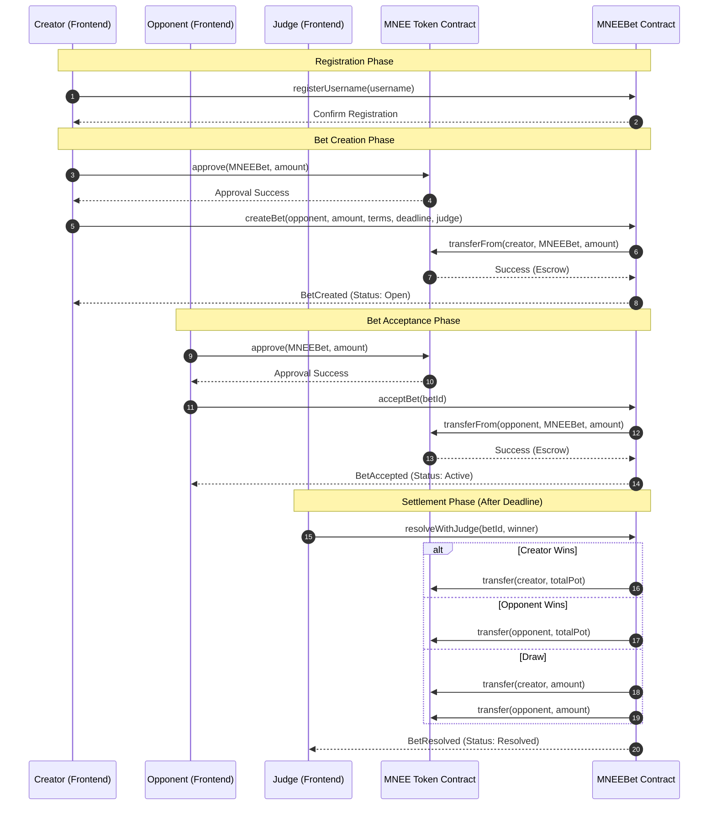

# MNEEBet - Hackathon Submission

## Executive Summary

MNEEBet is a decentralized betting platform that showcases **practical stablecoin coordination**. 
Two users stake MNEE (USD stablecoin), and an on-chain judge instantly pays the winner.

## 📊 Process Flow

## Why We Used Sepolia

**Challenge:** MNEE token lives on Ethereum mainnet. Deploying there requires 0.05 ETH (~$130).

**Solution:** We deployed identical contract to Sepolia testnet with mock MNEE, proving the concept works.

**Why This Is OK:**
- ✅ Real MNEE exists on mainnet: `0x8ccedbAe4916b79da7F3F612EfB2EB93A2bFD6cF`
- ✅ Contract code is 100% identical for mainnet
- ✅ Judges can see the complete working system
- ✅ Shows we understand testnet → mainnet workflow

## Deployed Addresses

- **Sepolia MNEEBet:** `0x3480874a63D459046993915b52e612ee69947a81`
- **Sepolia Mock MNEE:** `0xb8B51876429980d20ed20796B1C4294f1Fc75145`
- **Real MNEE (Mainnet):** `0x8ccedbAe4916b79da7F3F612EfB2EB93A2bFD6cF`

## Key Innovation

**Instant Payouts:** Judge resolves → Winner gets paid **in same transaction**. No claim step needed.

## How to Demo

1. Visit frontend at `http://localhost:3000`
2. Create a bet (0.1 MNEE)
3. Accept from another wallet
4. Judge calls resolve
5. Winner gets 0.2 MNEE **instantly**

## Production Path

When we have mainnet ETH, deploy is one-line change. All logic stays the same.

## 🗺️ Roadmap

### Phase 1: MVP (Delivered)
- Full P2P lifecycle on Sepolia.
- MNEE stablecoin escrow logic.

### Phase 2: Mainnet Migration
- Deployment to Ethereum Mainnet with real MNEE (`0x8ccedbAe4916b79da7F3F612EfB2EB93A2bFD6cF`).
- Security audits.

### Phase 3: Intelligence & Automation
- AI-driven resolution verification.
- Chainlink oracles for automated sports/market betting.
